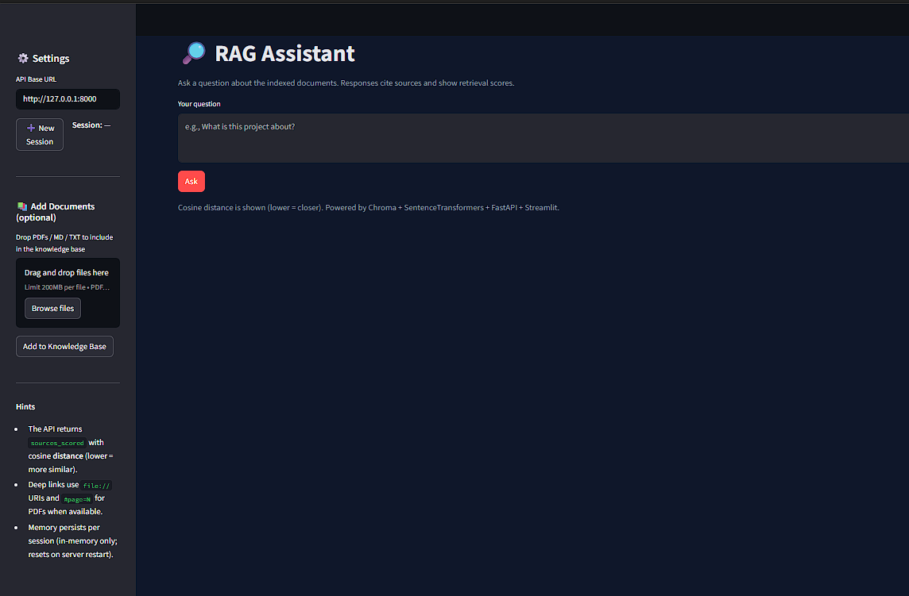

# RAG Assistant Demo

[](https://github.com/mwill20/rag-assistant-demo-/actions/workflows/ci.yml)
[](https://github.com/mwill20/rag-assistant-demo-/actions/workflows/dependency-review.yml)
[](https://github.com/mwill20/rag-assistant-demo-/actions/workflows/sbom.yml)
[](https://github.com/mwill20/rag-assistant-demo-/actions/workflows/gitleaks.yml)


A compact Retrieval-Augmented Generation (RAG) reference project with a clean CLI and a FastAPI service. It ships with ingestion, multiple retrieval modes (kNN, MMR, BM25), provider fallbacks (OpenAI → Groq → Gemini → none), and a small golden-tests harness to smoke-check RAG quality.

---

## Table of Contents

- [Features](#features)
- [Architecture](#architecture)
- [Quick Start](#quick-start)
  - [Windows (PowerShell)](#windows-powershell)
  - [macOS/Linux (bash/zsh)](#macoslinux-bashzsh)
- [Configuration](#configuration)
- [Data & Ingestion](#data--ingestion)
- [Retrieval Modes](#retrieval-modes)
- [CLI Usage](#cli-usage)
- [API Usage](#api-usage)
- [Testing & Quality](#testing--quality)
- [Operational Notes](#operational-notes)
- [Security & Responsible Use](#security--responsible-use)
- [Contributing](#contributing)
- [Roadmap](#roadmap)
- [License](#license)
- [Acknowledgments](#acknowledgments)

---

## Features

- **Deterministic CLI**: `python -m rag_assistant.qa` returns JSON by default; `--text` for human-readable.
- **FastAPI server**: lazy-loaded pipeline; `/healthz` is instant, `/ask` invokes on demand.
- **Ingestion**: idempotent; persists to `./storage` (Chroma), BOM-safe, prints chunk counts.
- **Retrieval**: Chroma vector store with MiniLM embeddings; modes: **kNN**, **MMR**, **BM25**.
- **LLM providers**: pluggable stack with fallback order (OpenAI → Groq → Gemini → none).
- **Output guard**: enforces prompts like “exactly N words”.
- **System prompts**: loaded from `.env` path or `src/rag_assistant/prompts/system_prompt.txt` with safe default.
- **Tests**: smoke tests, API health, and golden RAG checks; GitHub Actions CI included.

---

## Architecture

data/ # Your knowledge corpus (markdown/text files)
storage/ # ChromaDB persistence (created on ingest)
src/rag_assistant/
├── api.py # FastAPI app: /healthz, /ask
├── ingest.py # Corpus ingestion into Chroma
├── qa.py # CLI entrypoint
├── pipeline.py # Orchestration: retrieve → prompt → generate → format
├── retriever.py # kNN / MMR / BM25 strategies
├── llm_providers.py# Provider stack & fallbacks
└── prompts/
└── system_prompt.txt
tests/ # Smoke, health, and golden-check tests
.github/workflows/ci.yml # CI pipeline


**High-level flow**:  
Question → Retriever (kNN | MMR | BM25) → Context → Provider Stack → Answer (+sources)

---

## Quick Start

> Requirements: Python 3.11+, Git, and an internet connection for embeddings. Optional keys for LLM providers.

### Windows (PowerShell)

```powershell
# Clone
git clone https://github.com/mwill20/rag-assistant-demo-.git
cd rag-assistant-demo-

# Create & activate venv
python -m venv .venv
. .\.venv\Scripts\Activate.ps1

# Install
python -m pip install -U pip
pip install -e .

# Set local env paths
$env:DATA_DIR   = (Join-Path (Get-Location) 'data')
$env:CHROMA_DIR = (Join-Path (Get-Location) 'storage')

# Optional: provider keys
# $env:GROQ_API_KEY   = 'gsk_...'
# $env:OPENAI_API_KEY = 'sk-...'
# $env:GEMINI_API_KEY = '...'

# Ingest corpus
python -m rag_assistant.ingest

# Query (JSON default)
python -m rag_assistant.qa "What is this project?"

# Human-friendly
python -m rag_assistant.qa --text "Summarize this project in exactly 12 words"

# Run API (http://127.0.0.1:8000)
uvicorn rag_assistant.api:app --reload

### macOS/Linux (bash/zsh)
git clone https://github.com/mwill20/rag-assistant-demo-.git
cd rag-assistant-demo-

python -m venv .venv
source .venv/bin/activate

python -m pip install -U pip
pip install -e .

export DATA_DIR="$PWD/data"
export CHROMA_DIR="$PWD/storage"

# export GROQ_API_KEY="gsk_..."
# export OPENAI_API_KEY="sk-..."
# export GEMINI_API_KEY="..."

python -m rag_assistant.ingest
python -m rag_assistant.qa "What is this project?"
python -m rag_assistant.qa --text "What documents are in this corpus?"
uvicorn rag_assistant.api:app --reload

# Configuration
All configuration can be provided via environment variables or a local .env (kept out of git).

Variable	Default	Notes
DATA_DIR	./data	Path to corpus content (markdown/text).
CHROMA_DIR	./storage	ChromaDB persistence directory.
RETRIEVAL_MODE	knn	One of: knn, mmr, bm25.
TOP_K	2	Number of documents to retrieve.
SYSTEM_PROMPT_PATH	src/rag_assistant/prompts/system_prompt.txt	File or directory containing system prompt(s).
LLM_PREFERENCE	openai,groq,gemini,none	Comma-ordered fallbacks.
Provider keys	—	OPENAI_API_KEY, GROQ_API_KEY, GEMINI_API_KEY.

# Data & Ingestion
Place source files under data/ (e.g., *.md, *.txt). Then run:
python -m rag_assistant.ingest

Idempotent: re-running updates the vector store.

Prints chunk counts and final collection size.

Persists to ./storage so retrieval survives restarts.

To rebuild from scratch:
# Windows
python -c "import shutil,os; d='storage'; shutil.rmtree(d, ignore_errors=True); os.makedirs(d, exist_ok=True)"
# macOS/Linux
rm -rf storage && mkdir -p storage
python -m rag_assistant.ingest

# Retrieval Modes

Switch via RETRIEVAL_MODE:

kNN (default) – standard cosine similarity search.

MMR – Maximal Marginal Relevance for diversity-aware retrieval.

BM25 – Lexical retrieval (keyword matching) for sparse signals.

Examples:
# kNN
Remove-Item Env:RETRIEVAL_MODE -ErrorAction SilentlyContinue
python -m rag_assistant.qa "What is this project?"

# MMR
$env:RETRIEVAL_MODE = 'mmr'
python -m rag_assistant.qa "What documents are in this corpus?"

# BM25
$env:RETRIEVAL_MODE = 'bm25'
python -m rag_assistant.qa "What is this project?"

# CLI Usage
# JSON (default): prints {"answer": ..., "sources": [...]}
python -m rag_assistant.qa "How do I run the API?"

# Text: human-readable answer with sources listed below
python -m rag_assistant.qa --text "Summarize this project in exactly 12 words"
- The CLI respects “exactly N words” constraints via a post-formatting guard.

## API: `/ask` response (now includes retrieval scores)

The `/ask` endpoint returns both:
- **`sources`**: legacy list of file paths (strings) for backward compatibility.
- **`sources_scored`**: richer objects including cosine distance scores.

### Example request
```powershell
# Run the API locally in a separate terminal:
#   uvicorn rag_assistant.api:app --reload
# Then, from PowerShell:
$body = @{ question = "What is this project?" } | ConvertTo-Json
Invoke-RestMethod http://127.0.0.1:8000/ask -Method POST -Body $body -ContentType "application/json" | ConvertTo-Json -Depth 5

### Example response
{
  "answer": "RAG assistant ingests local docs and synthesizes answers from retrieved chunks.",
  "sources": [
    "C:\\path\\to\\repo\\data\\project_overview.md",
    "C:\\path\\to\\repo\\data\\usage_notes.md"
  ],
  "sources_scored": [
    {
      "path": "C:\\path\\to\\repo\\data\\project_overview.md",
      "page": null,
      "metric": "cosine",
      "score_type": "distance",
      "score": 1.53
    },
    {
      "path": "C:\\path\\to\\repo\\data\\usage_notes.md",
      "page": null,
      "metric": "cosine",
      "score_type": "distance",
      "score": 1.62
    }
  ]
}

### How to interpret scores

- We expose cosine distance (not raw similarity).
- Lower is better: 0.0 means vectors are identical; larger values mean farther apart.
- If you compare to “cosine similarity” in other tools, remember:
    - distance ≈ 1 − similarity
    - High similarity → low distance.

 Tip: Pair scores with debug views (e.g. top-k chunks) to evaluate retrieval quality and spot weak matches.

# Optional UI (Streamlit)
A minimal web UI is included for local demos. It talks to the FastAPI /ask endpoint, so session memory, deep links, and scores work as-is.

## Run
### Terminal 1: start API
uvicorn rag_assistant.api:app --reload

### Terminal 2: launch UI (repo root)
streamlit run .\ui.py

- Default API base: http://127.0.0.1:8000. Change via:

  - $env:RAG_API_BASE = "http://127.0.0.1:8001"
  - streamlit run .\ui.py

### Features
- Question box → answer with cited sources
- sources_scored table with cosine distance (lower = closer)
- Clickable file:// deep links (PDFs include #page=N)
- Session memory via session_id (in-memory; resets on restart)
- Optional doc upload (PDF/MD/TXT) → saved to ./data/ → auto-ingest



## Session Memory (Summarize-then-Trim)

The `/ask` endpoint now supports multi-turn conversations with a `session_id`.

- Each session maintains a rolling memory of Q&A turns.  
- When the session grows beyond 5 turns, the oldest turns are **summarized** into a compact form before being trimmed.  
- This ensures the assistant remembers context across questions without blowing up the prompt size.  
- If no `session_id` is provided, the server generates one and returns it in the response.

### Example: Multi-turn conversation
```powershell
# Start a new session
$body = @{ question = "What is this project?" } | ConvertTo-Json
$response = Invoke-RestMethod http://127.0.0.1:8000/ask -Method POST -Body $body -ContentType "application/json"
$response.session_id


# Testing & Quality
Local:
pytest -q

CI:
- GitHub Actions runs lint-free install, ingests a tiny corpus, and executes tests.
- Hugging Face cache is preserved across builds to speed up embeddings.

Golden checks:
- Basic evidence-containment and source-citation tests guard against hallucinations.
- Health test spins a transient uvicorn instance and probes /healthz.

# Operational Notes
- Windows paths: this repo uses PowerShell-friendly examples and BOM-safe file reading.
- Reproducibility: embeddings are deterministic; model generations depend on provider settings.
- Performance: tune TOP_K and retrieval mode; MMR/BM25 can offer better diversity on small corpora.

# Security & Responsible Use
- Do not commit secrets; store keys in your local environment or a secrets manager.
- Prompts attempt to filter unsafe formatting and enforce “exactly N words” when requested.
- Add your organizations acceptable-use and red-teaming notes under src/rag_assistant/prompts/ (see rails.md, redteam_checklist.md placeholders).

# Contributing
- Fork and create a feature branch.
- Add or update tests.
- Ensure pytest -q passes locally.
- Open a PR with a concise summary and screenshots or curl output where applicable.
See CONTRIBUTING.md and SECURITY.md for details (add these files if you plan to accept external contributions).

# Roadmap
- Provider “JSON mode” & strict Pydantic output option.
- Pluggable memory strategies (MEMORY_MODE: stuff/trim/summarize).
- /readyz deep-readiness and /ingest (local-only) endpoint with flag.
- Expanded golden dataset and eval harness.
- Optional Dockerfile (multi-stage) and SBOM.

# License
Specify a license appropriate to your needs (e.g., MIT, Apache-2.0) and include a LICENSE file at the repo root.

# Acknowledgments
- ChromaDB for vector storage.
- MiniLM embeddings (via sentence-transformers).
- FastAPI & Uvicorn.

# Contributing to RAG Assistant Demo

Thanks for your interest in improving this project! We welcome pull requests, bug reports, and feature suggestions.

## How to Contribute
1. **Fork and Branch**
   - Fork the repository.
   - Create a feature branch: `git checkout -b feature/my-change`.

2. **Code Style**
   - Keep code clean and Pythonic (PEP8).
   - Add docstrings for new functions or modules.

3. **Tests**
   - Run `pytest -q` locally before submitting.
   - Add or update tests for any new functionality.

4. **Pull Requests**
   - Ensure your PR has a clear title and description.
   - Include screenshots, logs, or curl output if relevant.

## Reporting Issues
- Use the GitHub Issues tab.
- Provide reproduction steps and environment details (OS, Python version, etc.).
- Label issues clearly (`bug`, `feature`, `question`).

## Code of Conduct
By participating, you agree to follow the [Code of Conduct](CODE_OF_CONDUCT.md).

# Security Policy

We take security seriously. Please review the following guidelines.

## Reporting a Vulnerability

- **Do not** open a public GitHub issue.
- Instead, email the maintainer privately: `security@example.com`.
- Include:
  - Detailed description of the issue.
  - Steps to reproduce.
  - Potential impact.
  - Suggested fix (if any).

We will acknowledge your report within 72 hours and aim to provide a fix within 30 days.

## Supported Versions

We currently maintain only the `main` branch. Older branches may not receive security patches.

## Safe Use

- **Do not commit secrets** (API keys, credentials).
- Use `.env` or a secrets manager for configuration.
- Follow your organizations acceptable-use guidelines when deploying.

## Responsible Disclosure

We ask researchers to give us a reasonable time window before publishing details. We will credit contributors who report responsibly.

# Code of Conduct

## Our Pledge

We are committed to providing a welcoming, harassment-free environment for all contributors, regardless of experience level, gender, identity, or background.

## Our Standards

Examples of positive behavior:
- Using inclusive and respectful language.
- Offering constructive feedback.
- Being patient with beginners.

Examples of unacceptable behavior:
- Harassment or discriminatory language.
- Trolling or insulting comments.
- Publishing others private information without consent.

## Enforcement

- Project maintainers have the right to remove comments, commits, or contributors that violate this Code.
- Reports of misconduct can be sent privately to: `maintainer@example.com`.

## Attribution

This Code of Conduct is adapted from the [Contributor Covenant](https://www.contributor-covenant.org/).
## Retrieval & Similarity (RAG internals)

**Vector store:** Chroma  
**Similarity metric:** Cosine similarity  
**Top-K (`k`):** 2 (by default in our retriever)  
**Chunking:** 500 characters, 50 overlap (~10%)

### What is cosine similarity?
Cosine similarity measures the angle between two vectors (here: embeddings).  
- Range: **-1 to 1**  
- **1.0** ⇒ identical direction (most similar)  
- **0.0** ⇒ unrelated/orthogonal  
- **-1.0** ⇒ opposite direction

Frameworks may report either **similarity** or **distance**:
- If you see **similarity**, **higher is better** (closer to 1).  
- If you see **distance = 1 − cosine_similarity**, **lower is better** (closer to 0).

### How we use it here
- We index chunks in Chroma and retrieve the **top-k=2** most similar chunks by **cosine similarity**.  
- Answers are grounded in those chunks and we cite sources.  
- If no chunk is sufficiently relevant, the system responds: “I don’t know based on the provided documents.”

### Practical assessment
- Expect good matches to have **cosine similarity ≳ 0.3–0.5** for short factual queries (rough heuristic; varies by corpus).  
- If you ever inspect scores (via custom logging or debugging code), remember:
  - **Similarity** near **1.0** ⇒ excellent match; near **0.0** ⇒ weak; negative ⇒ contradictory/noise.
  - If your tooling shows **distance** instead, invert your intuition: **0 is best**, larger is worse.

> Note: Our retriever currently returns documents (not raw scores) in the main pipeline. For deeper debugging, you can temporarily log scores from the underlying vector store client.
